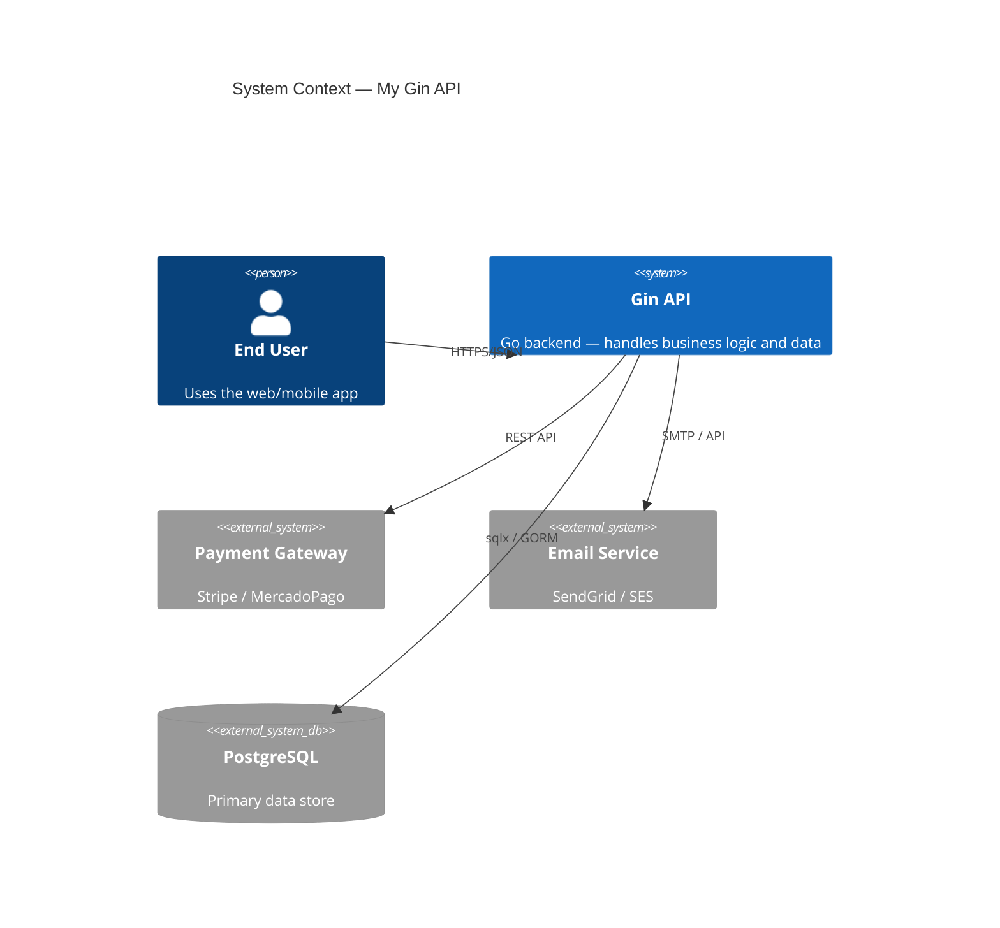

# golang-gin-architect — Pragmatic Software Architect

Think like a Staff Engineer who knows how to build the complex but chooses the simple. This skill guides architecture decisions for Go Gin APIs — system design, pattern selection, API evolution, and cross-cutting concerns. Orchestrates all other gin skills.

**Core principle:** Every recommendation has a complexity cost. The default answer is the simplest one that works. Complex patterns require justification.

## Greenfield Quickstart

Starting a new Gin project from scratch? Follow this sequence:

1. **golang-gin-architect** — Define complexity budget, choose project structure (small/medium/large)
2. **golang-gin-api** — Scaffold project: `cmd/api/main.go`, handlers, `AppError`, middleware
3. **golang-gin-database** — Add PostgreSQL: repository pattern, connection pooling, migrations
4. **golang-gin-auth** — Add JWT auth + RBAC middleware (if needed)
5. **golang-gin-testing** — Write unit + integration tests with testcontainers
6. **golang-gin-deploy** — Containerize: multi-stage Dockerfile, docker-compose, CI/CD

Skip steps 4-6 until you actually need them. Steps 1-3 cover most MVPs.

## When to Use

- Making architecture decisions (monolith vs microservices, sync vs async, SQL vs NoSQL)
- Evaluating if a pattern is overkill for the problem
- Designing a new system or major feature
- Planning API versioning and evolution strategy
- Setting up observability, caching, or security architecture
- Writing Architecture Decision Records (ADRs)
- Coordinating work across multiple gin skills
- Assessing and prioritizing tech debt

## Complexity Budget — Ask This First

Before recommending any pattern, run this checklist:

| Question | If Yes → | If No → |
|---|---|---|
| Team < 5 devs? | Keep it simple — monolith, flat structure | Consider bounded modules |
| < 10K RPM? | Standard Gin, PostgreSQL, no cache | Evaluate caching, read replicas |
| Single deployment target? | Monolith with clean packages | Consider service boundaries |
| Feature ships in < 1 week? | Direct implementation, no patterns | Plan architecture properly |
| Will this code change again soon? | Keep flexible but don't over-abstract | Optimize for clarity |
| Only 1 consumer of this API? | Internal contract, iterate fast | Version carefully |

**The DEFAULT path is always the simple one.** You need a reason to move right on the complexity scale.

```
Simple ──────────────────────────────── Complex
Direct SQL → Repository → CQRS → Event Sourcing
Monolith  → Modular Mono → Services → Microservices
REST      → REST+Events  → Full Async → Event Mesh
```

## Architecture Decision Tree

### "Should I use microservices?"

```
START: Do you have independent scaling needs?
  ├── No → MONOLITH. Stop here.
  └── Yes → Do you have 3+ teams that need to deploy independently?
      ├── No → MODULAR MONOLITH with clean package boundaries.
      └── Yes → Do you have the infra maturity (CI/CD, monitoring, tracing)?
          ├── No → MODULAR MONOLITH. Build infra maturity first.
          └── Yes → Extract the 1-2 services with clearest boundaries.
                    Keep everything else in the monolith.
```

**Rule:** Never start with microservices. Extract when pain is real and measured.

### "Do I need CQRS / Event Sourcing?"

```
START: Are reads and writes fundamentally different in shape?
  ├── No → Standard repository pattern. Stop here.
  └── Yes → Is read volume 10x+ write volume?
      ├── No → Separate read/write models in the same service.
      └── Yes → Do you need a full audit trail of every state change?
          ├── No → CQRS with materialized views. Skip event sourcing.
          └── Yes → Event sourcing. But understand the operational cost.
```

### "Sync or async?"

```
START: Does the caller need the result immediately?
  ├── Yes → Synchronous HTTP. Done.
  └── No → Is failure acceptable (retry later is OK)?
      ├── No → Synchronous with timeout + retry.
      └── Yes → Async with a message queue.
          └── Do you need exactly-once delivery?
              ├── No → Simple queue (Redis streams, SQS).
              └── Yes → Transactional outbox + idempotent consumers.
```

## Project Structure by Scale

### Small (1-3 devs, < 20 endpoints) — Flat Package Layout

```
myapp/
├── cmd/api/main.go
├── internal/
│   ├── handler/      # HTTP handlers
│   ├── service/      # Business logic
│   ├── repository/   # Data access
│   └── domain/       # Entities, errors, interfaces
├── pkg/middleware/
└── go.mod
```

**Skills:** golang-gin-api + golang-gin-database + golang-gin-testing. That's it.

### Medium (3-8 devs, 20-100 endpoints) — Feature Modules

```
myapp/
├── cmd/api/main.go
├── internal/
│   ├── user/          # Feature module
│   │   ├── handler.go
│   │   ├── service.go
│   │   ├── repository.go
│   │   └── model.go
│   ├── order/         # Feature module
│   │   ├── handler.go
│   │   ├── service.go
│   │   ├── repository.go
│   │   └── model.go
│   └── shared/        # Cross-cutting
│       ├── auth/
│       └── errors/
├── pkg/middleware/
└── go.mod
```

**Skills:** All gin skills. Feature teams own modules end-to-end.

### Large (8+ devs, 100+ endpoints) — Consider extraction only now

At this scale, evaluate whether specific modules should become separate services. See [references/system-design.md](references/system-design.md) for bounded context analysis.

### C4 Context Diagram Example

Use this template to document your system's external boundaries:



For full C4 model guidance (Container, Component levels): see [references/system-design.md](references/system-design.md).

## API Design Quick Rules

| Rule | Do | Don't |
|---|---|---|
| Versioning | URL prefix: `/api/v1/` | Header versioning (hard to test/debug) |
| Nouns | `GET /api/v1/users` | `GET /api/v1/getUsers` |
| Plurals | `/users`, `/orders` | `/user`, `/order` |
| Nesting | Max 2 levels: `/users/:id/orders` | `/users/:id/orders/:oid/items/:iid` |
| Pagination | Cursor-based for large sets, offset for small | Unbounded `GET /items` |
| Filtering | Query params: `?status=active&role=admin` | Request body for GET |
| Bulk ops | `POST /users/bulk` with array body | Individual calls in a loop |
| Errors | `{"error": "message", "code": "USER_NOT_FOUND"}` | Plain strings or HTML |

**Backwards compatibility rule:** Never remove a field, never change a field type, never change semantics. Add new fields, add new endpoints, deprecate old ones.

For complete API design patterns: see [references/api-design.md](references/api-design.md).

## Skill Orchestration — When to Call What

| Task | Primary Skill | Supporting Skills |
|---|---|---|
| New CRUD endpoint | **golang-gin-api** | golang-gin-database, golang-gin-testing |
| Add authentication | **golang-gin-auth** | golang-gin-api (route setup) |
| Schema design / migration | **golang-gin-psql-dba** | golang-gin-database (tooling) |
| Repository / ORM setup | **golang-gin-database** | golang-gin-psql-dba (schema decisions) |
| Performance issue | **golang-gin-psql-dba** | golang-gin-testing (benchmarks) |
| Containerize / deploy | **golang-gin-deploy** | golang-gin-testing (CI integration) |
| Write tests | **golang-gin-testing** | (reads all other skills) |
| Architecture decision | **golang-gin-architect** | Routes to others as needed |

**Orchestration rules:**
1. Always start with `golang-gin-architect` for architecture decisions — it routes to specific skills
2. `golang-gin-api` + `golang-gin-database` are the daily workhorses — most features only need these
3. `golang-gin-psql-dba` is for database *decisions* (schema, indexes, perf); `golang-gin-database` is for *code* (GORM/sqlx)
4. `golang-gin-auth` is standalone — activate only when adding/modifying auth flows
5. `golang-gin-deploy` is end-of-cycle — containerize after features work locally
6. `golang-gin-testing` is continuous — activate after every implementation

For detailed orchestration flows: see [references/skill-orchestration.md](references/skill-orchestration.md).

## Cross-Cutting Concerns Quick Reference

### Observability Stack

```go
// Structured logging — log/slog (stdlib)
logger := slog.New(slog.NewJSONHandler(os.Stdout, &slog.HandlerOptions{Level: slog.LevelInfo}))
logger.Info("request handled", "method", c.Request.Method, "path", c.FullPath(), "status", c.Writer.Status())

// Metrics — prometheus/client_golang
httpRequestsTotal := prometheus.NewCounterVec(prometheus.CounterOpts{
    Name: "http_requests_total",
    Help: "Total HTTP requests",
}, []string{"method", "path", "status"})

// Tracing — OpenTelemetry
// Use go.opentelemetry.io/contrib/instrumentation/github.com/gin-gonic/gin/otelgin
r.Use(otelgin.Middleware("myapp"))
```

### Caching Decision

```
START: Is data read more than written?
  ├── No → No cache needed.
  └── Yes → Is data the same for all users?
      ├── Yes → HTTP Cache-Control headers. Cheapest option.
      └── No → Is data < 100MB total?
          ├── Yes → In-memory cache (sync.Map or github.com/dgraph-io/ristretto).
          └── No → Redis. But measure first — PostgreSQL with proper indexes
                    handles more than you think.
```

### Security Architecture Checklist

- [ ] Input validation on all endpoints (ShouldBind + sanitize) → golang-gin-api
- [ ] JWT auth with short-lived tokens + refresh → golang-gin-auth
- [ ] RBAC middleware on protected routes → golang-gin-auth
- [ ] Rate limiting per IP and per user → golang-gin-api (rate-limiting reference)
- [ ] CORS configured for known origins only → golang-gin-api (middleware reference)
- [ ] SQL injection prevention (parameterized queries) → golang-gin-database
- [ ] Row-level security for multi-tenant → golang-gin-psql-dba
- [ ] Secrets in environment variables, never in code → golang-gin-deploy
- [ ] HTTPS termination at load balancer → golang-gin-deploy
- [ ] Dependency scanning in CI → golang-gin-deploy

For complete cross-cutting patterns: see [references/cross-cutting-concerns.md](references/cross-cutting-concerns.md).

## ADR Template (Lightweight)

```markdown
# ADR-NNN: Title

**Status:** Proposed | Accepted | Deprecated | Superseded by ADR-XXX
**Date:** YYYY-MM-DD
**Context:** What's the problem? Why are we deciding now?
**Decision:** What did we choose?
**Alternatives considered:**
- Option A: [why rejected]
- Option B: [why rejected]
**Consequences:** What changes? What's the trade-off?
```

Store ADRs in `docs/adr/` in your project. Number sequentially. Never delete — mark as superseded.

For templates for common decisions (database choice, auth strategy, caching layer): see [references/adr-templates.md](references/adr-templates.md).

## Tech Debt Quick Assessment

| Category | Symptoms | Priority |
|---|---|---|
| **Critical** | Security vulnerabilities, data loss risk, broken builds | Fix NOW |
| **High** | No tests for critical paths, hardcoded secrets, missing error handling | Next sprint |
| **Medium** | Duplicated code, inconsistent patterns, missing docs | Plan it |
| **Low** | Style inconsistencies, unused imports, verbose code | Boy scout rule |

**Rule of thumb:** If it slows down every PR, it's at least Medium. If it could wake you up at 3 AM, it's Critical.

For tech debt measurement framework and communication templates: see [references/tech-debt-management.md](references/tech-debt-management.md).

## Reference Files

Load these for deeper detail:

- **[references/complexity-assessment.md](references/complexity-assessment.md)** — Full decision trees, complexity budget framework, right-size thinking calibrated to team/product stage, pattern selection matrix, "you don't need this yet" gates
- **[references/system-design.md](references/system-design.md)** — C4 model, bounded context analysis, domain modeling, dependency graphs, module boundary design, Go package layout at scale
- **[references/data-patterns.md](references/data-patterns.md)** — CQRS, event sourcing, saga orchestration, transactional outbox, read replicas — high-complexity patterns, each with prerequisite gates and Go examples
- **[references/resilience-patterns.md](references/resilience-patterns.md)** — Circuit breaker, bulkhead, retry with exponential backoff, rate limiting at architecture level — low-cost patterns for external dependency resilience
- **[references/api-design.md](references/api-design.md)** — Versioning strategies, pagination contracts (cursor + offset), filtering, sorting, bulk operations, deprecation, backwards compatibility rules
- **[references/cross-cutting-concerns.md](references/cross-cutting-concerns.md)** — Observability (slog, Prometheus, OpenTelemetry), caching (in-memory, Redis, HTTP), security architecture, feature flags, configuration management
- **[references/adr-templates.md](references/adr-templates.md)** — ADR format, templates for database choice, auth strategy, caching layer, service extraction, with worked examples
- **[references/skill-orchestration.md](references/skill-orchestration.md)** — Detailed decision matrix for when to activate each gingo skill, common workflow sequences, skill composition patterns
- **[references/tech-debt-management.md](references/tech-debt-management.md)** — Debt quadrant (reckless/prudent × deliberate/inadvertent), measurement framework, prioritization matrix, stakeholder communication templates
- **[references/clean-architecture.md](references/clean-architecture.md)** — Uncle Bob's layers mapped to Go packages, dependency rule, ports & adapters (hexagonal), manual DI wiring, complete feature module example, common mistakes
- **[references/redis-caching-strategy.md](references/redis-caching-strategy.md)** — Smart caching: decision matrix by data type, cache stampede prevention (singleflight), warming, pub/sub invalidation, session storage, distributed locking
- **[references/messaging-patterns.md](references/messaging-patterns.md)** — Async messaging with RabbitMQ: producer/consumer, work queues, pub/sub exchanges, dead letter queues, idempotent consumers
- **[references/object-storage.md](references/object-storage.md)** — S3-compatible storage (AWS, MinIO, R2): upload/download, presigned URLs, multipart upload, MinIO for local dev
- **[references/error-flow-architecture.md](references/error-flow-architecture.md)** — How errors flow domain→service→handler, wrapping conventions, sentinel vs custom types, errors.Is/As, complete error chain example
- **[references/golden-main-template.md](references/golden-main-template.md)** — Production-ready cmd/api/main.go templates (small + medium), startup sequence, graceful shutdown, dependency wiring
- **[references/grpc-interop.md](references/grpc-interop.md)** — Running Gin HTTP + gRPC in same project, shared service layer, cmux multiplexer, buf toolchain, gRPC-Gateway
- **[references/data-ownership.md](references/data-ownership.md)** — Database-per-service, API composition, data sync strategies, shared reference data, migration path from monolith

## Cross-Skill References

- For REST endpoint implementation patterns: see the **golang-gin-api** skill
- For JWT auth and RBAC: see the **golang-gin-auth** skill
- For PostgreSQL schema and query decisions: see the **golang-gin-psql-dba** skill
- For GORM/sqlx repository code: see the **golang-gin-database** skill
- For testing strategies: see the **golang-gin-testing** skill
- For Docker, K8s, and CI/CD: see the **golang-gin-deploy** skill
