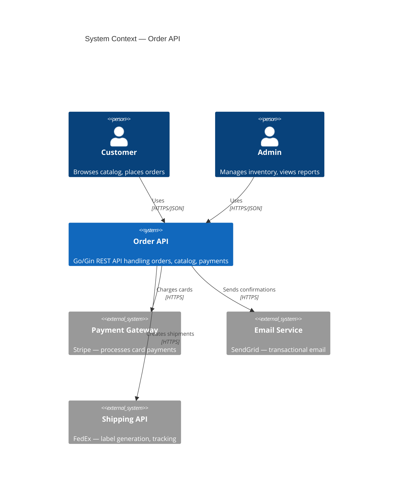
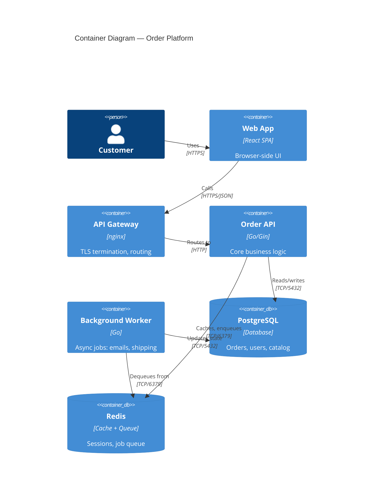
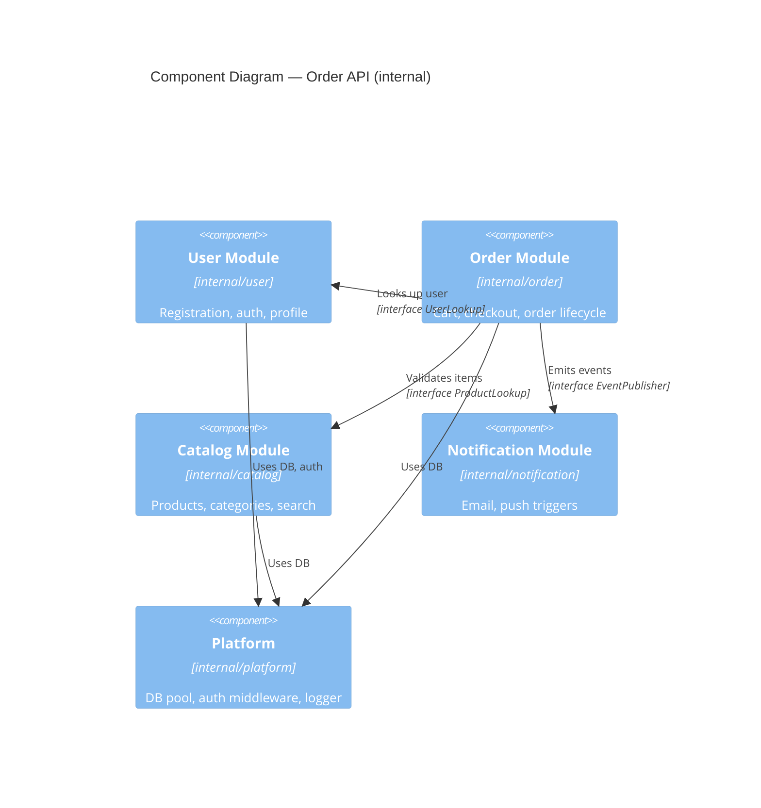

# System Design Reference

This file covers system design tools for Go Gin APIs: C4 model usage, bounded context analysis, domain modeling, dependency management, module boundary design, and Go package layout at scale. Load when making structural architecture decisions, evaluating service extraction, or designing module boundaries. These are heavyweight tools — the gate question for every section is "does my project actually need this?"

> **Default stance:** A CRUD API with a single team does NOT need C4 diagrams, bounded contexts, or domain modeling. Use these tools when complexity is real and measured, not anticipated.

## Table of Contents

1. [C4 Model for Go APIs](#c4-model-for-go-apis)
2. [Bounded Context Analysis](#bounded-context-analysis)
3. [Domain Modeling — When You Need It](#domain-modeling--when-you-need-it)
4. [Dependency Graphs](#dependency-graphs)
5. [Module Boundary Design](#module-boundary-design)
6. [Go Package Layout at Scale](#go-package-layout-at-scale)

---

## C4 Model for Go APIs

### When to use this

| Level | Use when |
|---|---|
| **Context** | Always — one diagram, 5 min to draw, answers "what does this system do and who talks to it?" |
| **Container** | You have multiple deployable units (API + worker + frontend + DB) |
| **Component** | A single container has enough internal complexity that new devs get lost |
| **Code** | Almost never. Use Go doc comments + package structure instead. |

If you have a single Gin API talking to one PostgreSQL database: draw Context, stop there. The remaining levels add maintenance burden with little return.

### Level 1 — Context Diagram

Shows the system boundary and its actors/external systems. One box per external thing.



**Rule:** If you can't fit this on one page, you have too many external dependencies — that's the real problem to solve.

### Level 2 — Container Diagram

Shows deployable units. Use when you have more than one process running.



### Level 3 — Component Diagram

Shows internal structure of one container. Use only when a container has 5+ distinct responsibilities and onboarding new devs takes more than a day.



**Go-specific mapping:** Each C4 component maps to a Go package under `internal/`. The arrows between components must be satisfied by Go interfaces, not direct struct references — that is how you prevent import cycles and enforce boundaries.

### Level 4 — Code Level

Skip it. Go package documentation, `go doc`, and readable package structure do this better with zero maintenance cost.

---

## Bounded Context Analysis

### When to use this

Use bounded context analysis when:
- You have a "God model" — one `User` struct imported everywhere, growing to 40+ fields
- Different teams argue about what fields belong in a shared struct
- Changing one part of the domain model breaks unrelated features
- You're evaluating whether to extract a module into a separate service

Skip it when you have a simple app with one team and < 10 domain entities.

### Identifying Implicit Bounded Contexts

Symptoms that indicate implicit bounded contexts exist inside your monolith:

- The word "User" means different things in different features (a `User` in auth is credentials + roles; a `User` in billing is payment methods + invoice history; a `User` in notification is email + push token preferences)
- Package A and Package B both define a `Product` struct with different fields
- You have a `types` or `models` package that everything imports — and it keeps growing
- Merge conflicts regularly happen in the same files even for unrelated features

### How to Find Your Bounded Contexts

1. **Noun workshop:** List every noun (entity/concept) in the domain. Write on sticky notes.
2. **Group by team/feature ownership:** Which nouns naturally cluster together?
3. **Identify ubiquitous language:** Do "User" and "Customer" mean the same thing in all clusters? If not, they're in different contexts.
4. **Look at change frequency:** Files that always change together are in the same context. Files that change independently are candidates for separate contexts.
5. **Find the seams:** Where do contexts need to communicate? Those are your integration points — model them as interfaces.

### Package Boundary Design

When `internal/user` and `internal/order` have separate concerns, they should NOT share domain types directly.

```
Bad: internal/order imports internal/user.User (full domain model)
Good: internal/order defines its own view of what it needs from user
```

```go
// internal/order/ports.go
// "ports" = interfaces this module needs from outside
package order

import "context"

// UserLookup is order's view of what it needs from the user domain.
// It is defined HERE, not in internal/user — the order module owns its dependencies.
type UserLookup interface {
    GetByID(ctx context.Context, id string) (UserInfo, error)
}

// UserInfo is order's projection of a user — NOT the full user domain model.
// Only contains what order actually needs. Adding a field to user.User
// does NOT require changing this struct.
type UserInfo struct {
    ID    string
    Name  string
    Email string
}
```

```go
// internal/order/service.go
package order

import (
    "context"
    "fmt"
    "log/slog"
)

type Service struct {
    repo   Repository
    users  UserLookup  // injected — order doesn't care about the concrete type
    logger *slog.Logger
}

func NewService(repo Repository, users UserLookup, logger *slog.Logger) *Service {
    return &Service{repo: repo, users: users, logger: logger}
}

func (s *Service) Create(ctx context.Context, req CreateOrderRequest) (*Order, error) {
    user, err := s.users.GetByID(ctx, req.UserID)
    if err != nil {
        return nil, fmt.Errorf("order.Service.Create: lookup user: %w", err)
    }
    // use user.Email for notification, user.Name for order record
    // order module never touches password hashes, roles, or any other user internals
    _ = user
    // ... rest of business logic
    return nil, nil
}
```

### Context Mapping Patterns (Lightweight)

You don't need the full DDD context mapping vocabulary. Three patterns cover most Go monolith scenarios:

| Pattern | Use when | Go implementation |
|---|---|---|
| **Shared Kernel** | Two modules share a small, stable set of types (e.g., `Money`, `Address`) | `internal/shared/` package — kept tiny, changes require both teams to agree |
| **Anti-Corruption Layer** | Integrating with an external system whose model you don't control (Stripe, external ERP) | Adapter struct in `internal/[domain]/adapters/` that translates external → internal model |
| **Conformist** | You're a downstream consumer of an upstream API and it's too costly to translate | Accept their model, document the dependency explicitly |

```go
// Anti-corruption layer example: Stripe payment intent → internal PaymentResult
// internal/billing/adapters/stripe_adapter.go
package adapters

import (
    "fmt"
    stripe "github.com/stripe/stripe-go/v75"
    "myapp/internal/billing"
)

// StripeAdapter translates Stripe's model to our internal billing model.
// All Stripe-specific types stay in this file — billing domain never imports stripe-go.
type StripeAdapter struct {
    client *stripe.Client
}

func (a *StripeAdapter) Charge(amount int64, currency, token string) (*billing.PaymentResult, error) {
    // call stripe, translate response
    pi, err := a.client.PaymentIntents.New(nil)
    if err != nil {
        return nil, fmt.Errorf("stripe charge: %w", err)
    }
    return &billing.PaymentResult{
        TransactionID: pi.ID,
        Amount:        amount,
        Status:        translateStatus(pi.Status),
    }, nil
}

func translateStatus(s stripe.PaymentIntentStatus) billing.PaymentStatus {
    switch s {
    case stripe.PaymentIntentStatusSucceeded:
        return billing.PaymentStatusSucceeded
    case stripe.PaymentIntentStatusCanceled:
        return billing.PaymentStatusFailed
    default:
        return billing.PaymentStatusPending
    }
}
```

---

## Domain Modeling — When You Need It

### The Decision Gate

```
Does my entity have business rules that enforce invariants?
  ├── No  → Struct + repository pattern. Stop here.
  │         (CRUD apps, data pipelines, reporting APIs)
  └── Yes → Do I have complex state transitions (order: draft→confirmed→shipped→delivered)?
      ├── No  → Methods on structs that validate state + service layer.
      └── Yes → Consider value objects and domain events.
                But: measure the complexity first. Most "state machines"
                are 3 states — an enum + a method handles that fine.
```

**Practical heuristic:** If all your service methods look like `Create/Get/Update/Delete` with no branching business logic, you have a data API. Domain modeling adds overhead without benefit. Use it when your services have methods like `ConfirmOrder`, `CancelSubscription`, `ProcessRefund` — operations with rules and side effects.

### Entities with Behavior

An entity has identity (ID) and enforces its own invariants through methods.

```go
// internal/order/model.go
package order

import (
    "fmt"
    "time"
)

type Order struct {
    ID        string
    UserID    string
    Status    OrderStatus
    Items     []OrderItem
    Total     int64 // store in cents — never float for money
    CreatedAt time.Time
    UpdatedAt time.Time
}

type OrderStatus string

const (
    OrderStatusDraft     OrderStatus = "draft"
    OrderStatusConfirmed OrderStatus = "confirmed"
    OrderStatusShipped   OrderStatus = "shipped"
    OrderStatusDelivered OrderStatus = "delivered"
    OrderStatusCancelled OrderStatus = "cancelled"
)

// Confirm enforces business rules. Not just a status setter.
// Returns error if transition is invalid — callers handle the error, not ignore it.
func (o *Order) Confirm() error {
    if o.Status != OrderStatusDraft {
        return fmt.Errorf("cannot confirm order in status %q — expected %q", o.Status, OrderStatusDraft)
    }
    if len(o.Items) == 0 {
        return fmt.Errorf("cannot confirm empty order")
    }
    o.Status = OrderStatusConfirmed
    o.UpdatedAt = time.Now()
    return nil
}

// Cancel allows cancellation from draft or confirmed states only.
func (o *Order) Cancel(reason string) error {
    switch o.Status {
    case OrderStatusDraft, OrderStatusConfirmed:
        o.Status = OrderStatusCancelled
        o.UpdatedAt = time.Now()
        return nil
    default:
        return fmt.Errorf("cannot cancel order in status %q", o.Status)
    }
}

// AddItem validates the item before appending. Keeps invariant: no zero-price items.
func (o *Order) AddItem(item OrderItem) error {
    if o.Status != OrderStatusDraft {
        return fmt.Errorf("cannot add items to order in status %q", o.Status)
    }
    if item.Price <= 0 {
        return fmt.Errorf("item price must be positive, got %d", item.Price)
    }
    o.Items = append(o.Items, item)
    o.Total += item.Price * int64(item.Quantity)
    return nil
}
```

### Value Objects

Immutable, compared by value (not ID). Use for concepts like `Money`, `Address`, `Email`, `PhoneNumber` that have their own validation rules.

```go
// internal/shared/money.go
package shared

import "fmt"

// Money is a value object — no ID, compared by value, immutable after creation.
type Money struct {
    Amount   int64  // cents
    Currency string // ISO 4217: "USD", "EUR"
}

// NewMoney validates and constructs a Money value.
func NewMoney(amount int64, currency string) (Money, error) {
    if amount < 0 {
        return Money{}, fmt.Errorf("money amount cannot be negative: %d", amount)
    }
    if len(currency) != 3 {
        return Money{}, fmt.Errorf("invalid currency code %q — must be ISO 4217 (3 chars)", currency)
    }
    return Money{Amount: amount, Currency: currency}, nil
}

func (m Money) Add(other Money) (Money, error) {
    if m.Currency != other.Currency {
        return Money{}, fmt.Errorf("cannot add %s and %s", m.Currency, other.Currency)
    }
    return Money{Amount: m.Amount + other.Amount, Currency: m.Currency}, nil
}

func (m Money) IsZero() bool { return m.Amount == 0 }

func (m Money) String() string { return fmt.Sprintf("%d %s", m.Amount, m.Currency) }
```

**When NOT to use value objects:** If `Address` is just stored and displayed without validation rules, a plain struct is fine. Value objects earn their weight when you have validation logic that would otherwise be scattered.

### Domain Services

Operations that span multiple entities and don't naturally belong to one entity's methods.

```go
// internal/order/pricing_service.go
package order

import (
    "context"
    "fmt"
)

// PricingService calculates order totals applying discounts and taxes.
// Lives here because pricing spans items, promotions, and tax rules —
// no single entity owns this logic.
type PricingService struct {
    promotionRepo PromotionRepository
    taxRepo       TaxRuleRepository
}

func (s *PricingService) Calculate(ctx context.Context, o *Order, promoCode string) (int64, error) {
    base := o.Total
    if promoCode != "" {
        promo, err := s.promotionRepo.GetByCode(ctx, promoCode)
        if err != nil {
            return 0, fmt.Errorf("pricing: lookup promo %q: %w", promoCode, err)
        }
        base = promo.Apply(base)
    }
    tax, err := s.taxRepo.GetRateForUser(ctx, o.UserID)
    if err != nil {
        return 0, fmt.Errorf("pricing: get tax rate: %w", err)
    }
    return base + int64(float64(base)*tax), nil
}
```

### Domain Events (Use Sparingly)

Domain events decouple modules — an order doesn't call the notification service directly; it emits an `OrderConfirmed` event. Use when you need cross-module communication without creating import dependencies.

```go
// internal/order/events.go
package order

import "time"

// OrderConfirmed is published when an order transitions to confirmed status.
// Consumers: notification (send email), inventory (reserve stock), analytics (record sale).
type OrderConfirmed struct {
    OrderID   string
    UserID    string
    Total     int64
    OccurredAt time.Time
}

// internal/order/service.go — publishing the event
func (s *Service) Confirm(ctx context.Context, orderID string) error {
    o, err := s.repo.GetByID(ctx, orderID)
    if err != nil {
        return fmt.Errorf("order.Service.Confirm: %w", err)
    }
    if err := o.Confirm(); err != nil {
        return fmt.Errorf("order.Service.Confirm: %w", err)
    }
    if err := s.repo.Save(ctx, o); err != nil {
        return fmt.Errorf("order.Service.Confirm: save: %w", err)
    }
    s.events.Publish(ctx, OrderConfirmed{
        OrderID:    o.ID,
        UserID:     o.UserID,
        Total:      o.Total,
        OccurredAt: o.UpdatedAt,
    })
    return nil
}
```

**Warning:** In-process event buses feel elegant but add hidden control flow. For most apps, explicit service calls (order service calls notification service) are easier to trace, test, and debug. Use events when you have 3+ consumers of the same trigger, or when you need cross-module decoupling for separate deployment.

---

## Dependency Graphs

### When to use this

Always think about this. Dependency direction determines which parts of your code are easy to change and which are risky. You don't need a tool — you need the habit of asking "what depends on what?"

### The No-Cycles Rule

Go enforces this at the compiler level: circular imports are compile errors. But you can still create logical cycles that the compiler allows (A calls B which calls A through an interface). These are harder to detect and harder to fix.

```
Good dependency direction (arrows show "depends on"):
Handler → Service → Repository → Database
   ↓          ↓           ↓
Domain ←──────────────────────  (domain has no outward deps)
```

```
Bad: Service imports Handler package
Bad: Repository imports Service package
Bad: Domain imports anything from internal/
```

**Rule:** Dependencies flow inward. The domain layer (entities, interfaces, errors) depends on nothing. Everything else depends on domain. This is the dependency rule — follow it and your code stays testable and changeable.

### Dependency Inversion with Interfaces

Instead of `order.Service` importing `user.Service` directly:

```go
// Bad — creates a hard dependency, makes testing harder
import "myapp/internal/user"

type OrderService struct {
    userSvc *user.Service  // hard dependency on concrete type
}
```

```go
// Good — order defines what it needs, user satisfies it
// internal/order/ports.go
type UserLookup interface {
    GetByID(ctx context.Context, id string) (UserInfo, error)
}

// internal/order/service.go
type Service struct {
    users UserLookup  // interface — testable, no import of user package
}
```

### Practical main.go Wiring

`main.go` is the only place that knows about concrete types. It wires everything together.

```go
// cmd/api/main.go
func main() {
    db := platform.NewDB(cfg.DatabaseURL)
    logger := slog.New(slog.NewJSONHandler(os.Stdout, nil))

    // Repositories (concrete types, implement interfaces)
    userRepo := user.NewPostgresRepository(db)
    orderRepo := order.NewPostgresRepository(db)

    // Services (receive interfaces, not concrete types)
    userSvc := user.NewService(userRepo, logger)
    orderSvc := order.NewService(orderRepo, userSvc, logger) // userSvc satisfies order.UserLookup

    // Handlers
    userHandler := user.NewHandler(userSvc, logger)
    orderHandler := order.NewHandler(orderSvc, logger)

    // Router
    r := setupRouter(userHandler, orderHandler)
    // ...
}
```

`main.go` is allowed to be messy — it's the composition root. Keep business logic out of it.

### Visualizing Your Dependency Graph

For a quick snapshot without external tools:

```bash
# List what each package imports (Go standard tooling)
go list -f '{{.ImportPath}}: {{join .Imports ", "}}' ./internal/...
```

Red flags in the output:
- `internal/domain` importing anything from `internal/` — domain should be clean
- Any `internal/X` importing `internal/handler` or `cmd/` packages
- Two packages that mutually import each other (Go will reject this at compile time, but interfaces can hide logical cycles)

---

## Module Boundary Design

### When to split into separate Go modules (go.mod)

**Default: one module for everything.** Split only when you have a genuine reason:

| Reason to split | Example |
|---|---|
| Independently versioned and released library | `github.com/myorg/myapp-sdk` — consumed by other teams |
| Separate deployment unit that must not import app internals | A CLI tool distributed separately |
| Third-party shared package used across multiple repos | `github.com/myorg/shared-middleware` |

Do NOT split because you think it looks cleaner. Multiple go.mod files add tooling complexity (dependency sync, replace directives in local dev, CI matrix).

### internal/ for Encapsulation

Go enforces `internal/` access: code in `internal/user/` can only be imported by code with the same module root. This is your primary encapsulation tool without needing multiple modules.

```
myapp/internal/user/    → importable by myapp, NOT by external consumers
myapp/internal/order/   → same
myapp/pkg/httputil/     → importable by anyone (use sparingly)
```

**Rule:** Put everything in `internal/` by default. Only move to `pkg/` if you have a genuine external consumer.

### Shared Types: Where Do They Live?

| Type | Location | Rationale |
|---|---|---|
| Domain entities specific to one module | `internal/[module]/model.go` | Owned by that module |
| Projection types used across modules | Each module defines its own (see ports.go pattern above) | Prevents coupling |
| Truly shared value objects (Money, Address) | `internal/shared/` | Accept shared ownership — keep tiny |
| HTTP utilities (response helpers, pagination) | `pkg/httputil/` | Reusable, no domain knowledge |

**Anti-pattern: the "types" package**

```
// Do NOT do this
internal/
└── types/
    ├── user.go      ← user.User, user.Role, user.Session...
    ├── order.go     ← order.Order, order.Item, order.Status...
    └── product.go   ← all the product types...
```

This creates a package that everything imports and nobody owns. Every change to `types/` is a blast radius across the entire codebase. Distribute types to their owning modules instead.

---

## Go Package Layout at Scale

### Small: 1-3 devs, < 20 endpoints — Flat Layout

```
myapp/
├── cmd/api/main.go
├── internal/
│   ├── handler/          # All HTTP handlers
│   ├── service/          # All business logic
│   ├── repository/       # All data access
│   └── domain/           # Entities, interfaces, errors
├── pkg/
│   └── middleware/       # Shared middleware
└── go.mod
```

One package per layer. Simple to navigate. Works until the team grows or domains start to conflict.

**Activate:** golang-gin-api + golang-gin-database + golang-gin-testing. No golang-gin-architect needed yet.

### Medium: 3-8 devs, 20-100 endpoints — Feature Modules

```
myapp/
├── cmd/api/main.go
├── internal/
│   ├── user/
│   │   ├── handler.go
│   │   ├── service.go
│   │   ├── repository.go
│   │   ├── model.go
│   │   └── ports.go        # interfaces this module needs from others
│   ├── order/
│   │   ├── handler.go
│   │   ├── service.go
│   │   ├── repository.go
│   │   ├── model.go
│   │   └── ports.go
│   ├── catalog/
│   │   ├── handler.go
│   │   ├── service.go
│   │   ├── repository.go
│   │   └── model.go
│   ├── notification/
│   │   ├── service.go      # no handler — internal only
│   │   └── email.go
│   └── platform/           # shared infrastructure — not a business domain
│       ├── database/
│       │   └── db.go       # connection pool, transaction helpers
│       ├── auth/
│       │   └── middleware.go
│       └── middleware/
│           ├── logger.go
│           ├── recovery.go
│           └── requestid.go
├── pkg/
│   └── httputil/           # truly reusable: pagination, response helpers
└── go.mod
```

Each feature module owns its full vertical slice: handler → service → repository → model. Teams can work independently. `ports.go` defines the module's external interface contracts.

**The `platform/` package** is infrastructure — not a domain. It provides DB connections, middleware, and auth helpers. Business modules import from `platform/`, never the reverse.

### Large: 8+ devs, 100+ endpoints — Evaluate Extraction

At this scale, the feature-module layout still works. Before extracting to microservices, ask:

1. Which module has independent scaling requirements (traffic profile very different from the rest)?
2. Which module needs to deploy independently (different release cadence, different team)?
3. Which module has a clear, stable interface that won't change frequently?

If you can't answer all three for the same module, keep it in the monolith. Extract the one or two modules that genuinely qualify. Use the bounded context analysis above to validate the seams before cutting.

```
myapp/                         extracted/
├── cmd/api/main.go            ├── cmd/catalog-api/main.go
├── internal/                  ├── internal/
│   ├── user/                  │   └── catalog/
│   ├── order/                 └── go.mod
│   ├── notification/
│   └── platform/
└── go.mod
```

**The extracted service talks to the monolith via HTTP or gRPC, not shared DB tables.** Shared DB access between services defeats the purpose and makes independent deployment impossible.

### Shared Infrastructure in `platform/`

```go
// internal/platform/database/db.go
package database

import (
    "fmt"
    "log/slog"
    "time"

    "github.com/jmoiron/sqlx"
    _ "github.com/lib/pq"
)

type Config struct {
    DSN             string
    MaxOpenConns    int
    MaxIdleConns    int
    ConnMaxLifetime time.Duration
}

func New(cfg Config, logger *slog.Logger) (*sqlx.DB, error) {
    db, err := sqlx.Connect("postgres", cfg.DSN)
    if err != nil {
        return nil, fmt.Errorf("database.New: %w", err)
    }
    db.SetMaxOpenConns(cfg.MaxOpenConns)
    db.SetMaxIdleConns(cfg.MaxIdleConns)
    db.SetConnMaxLifetime(cfg.ConnMaxLifetime)
    logger.Info("database connected", "dsn_prefix", cfg.DSN[:min(len(cfg.DSN), 30)])
    return db, nil
}
```

Each feature module receives `*sqlx.DB` via constructor injection from `main.go`. They never construct their own DB connections.

---

## Cross-Skill References

- For complexity budget (when patterns are overkill): see **[complexity-assessment.md](complexity-assessment.md)**
- For data patterns (CQRS, event sourcing, saga, outbox): see **[data-patterns.md](data-patterns.md)**
- For resilience patterns (circuit breaker, bulkhead, retry): see **[resilience-patterns.md](resilience-patterns.md)**
- For API versioning and contract design: see **[api-design.md](api-design.md)**
- For observability, caching, security architecture: see **[cross-cutting-concerns.md](cross-cutting-concerns.md)**
- For repository and ORM code: see the **golang-gin-database** skill
- For handler and middleware implementation: see the **golang-gin-api** skill
